<!-- README.md is generated from README.Rmd. Please edit that file -->

# ggstats101

<!-- badges: start -->
<!-- badges: end -->

The goal of ggstats101 is to model a clean and efficient way to create
functionality that’s in line with ggplot2 grammar for an intro to
statistics/probability class. This will allow you to build up plots
layer by layer alongside the concepts you build up.

Many examples are from the ISI curriculum.
<https://www.isi-stats.com/isi2nd/data.html>

This project explores using ‘statexpress’ as a short-hand for
experimenting with layers.

Without extension:

``` r
library(tidyverse)
#> ── Attaching core tidyverse packages ──────────────────────── tidyverse 2.0.0 ──
#> ✔ dplyr     1.1.4     ✔ readr     2.1.5
#> ✔ forcats   1.0.0     ✔ stringr   1.5.1
#> ✔ ggplot2   3.5.1     ✔ tibble    3.2.1
#> ✔ lubridate 1.9.3     ✔ tidyr     1.3.1
#> ✔ purrr     1.0.2     
#> ── Conflicts ────────────────────────────────────────── tidyverse_conflicts() ──
#> ✖ dplyr::filter() masks stats::filter()
#> ✖ dplyr::lag()    masks stats::lag()
#> ℹ Use the conflicted package (<http://conflicted.r-lib.org/>) to force all conflicts to become errors
```

``` r
donor <- read_delim("https://www.isi-stats.com/isi/data/prelim/OrganDonor.txt") %>%
  mutate(Choice = fct_rev(Choice))
#> Rows: 161 Columns: 2
#> ── Column specification ────────────────────────────────────────────────────────
#> Delimiter: "\t"
#> chr (2): Default, Choice
#> 
#> ℹ Use `spec()` to retrieve the full column specification for this data.
#> ℹ Specify the column types or set `show_col_types = FALSE` to quiet this message.
```

``` r

donor
#> # A tibble: 161 × 2
#>    Default Choice
#>    <chr>   <fct> 
#>  1 opt-in  donor 
#>  2 opt-in  donor 
#>  3 opt-in  donor 
#>  4 opt-in  donor 
#>  5 opt-in  donor 
#>  6 opt-in  donor 
#>  7 opt-in  donor 
#>  8 opt-in  donor 
#>  9 opt-in  donor 
#> 10 opt-in  donor 
#> # ℹ 151 more rows
```

``` r

donor |>
  ggplot() +
  aes(x = Choice) + 
  geom_dotplot()
#> Bin width defaults to 1/30 of the range of the data. Pick better value with
#> `binwidth`.
```

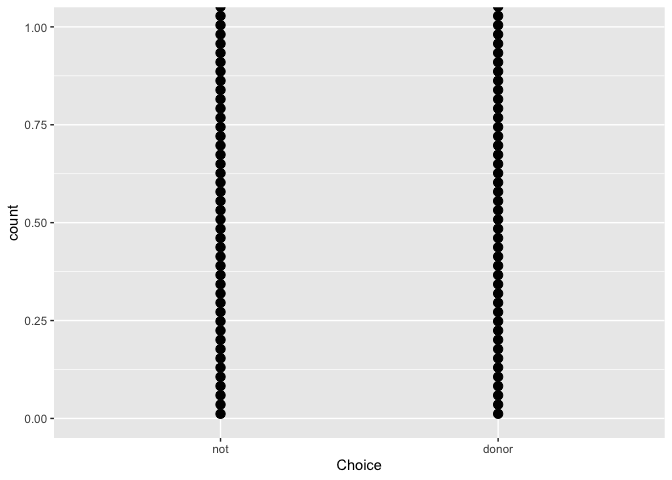

``` r

donor |>
  ggplot() +
  aes(x = Choice) + 
  geom_bar()
```

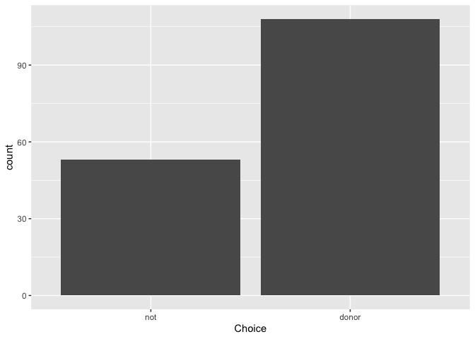

``` r

donor %>%
    janitor::tabyl(Choice) %>%
    janitor::adorn_totals()
#>  Choice   n   percent
#>     not  53 0.3291925
#>   donor 108 0.6708075
#>   Total 161 1.0000000
```

# rethinking

``` r
library(tidyverse)
library(statexpress)

compute_group_bricks <- function(data, scales){
  
  if(!is.null(data$weight)){data %>% uncount(weight)}
  
  data %>% 
    mutate(row = row_number()) %>% 
    mutate(y = row - .5)
  
}

compute_xmean_at_y0 <- function(data, scales){
  
  data %>% 
    summarise(x = mean(x),
              y = 0) 
  
}

compute_scale <- function(data, scales){
  
  data %>% 
    summarise(min_x = min(x),
              xend = max(x),
              y = 0,
              yend = 0) %>% 
    rename(x = min_x)
  
}


donor |>
  ggplot() +
  aes(x = Choice) +
  # 1. geom_stack() -- show counts in a count-y way (i.e. bricks!), 
  # with a good amount of space in-between stacks
  qlayer(stat = qstat(compute_group_bricks,
                      default_aes = aes(width = after_stat(.2))),
         geom = qproto_update(GeomTile, 
                              aes(color = "whitesmoke"))) +
  # 2. geom_stack_label() -- label stacks
  qlayer(stat = qproto_update(StatCount, aes(label = after_stat(count),
                                             vjust = after_stat(0))),
         geom = GeomText) +
  # 3. geom_xrange, show scale, range at y is zero
  qlayer(stat = qstat_panel(compute_scale),
         geom = GeomSegment) +
  # 3. geom_prop, show prop, i.e. balancing point
  qlayer(stat = qstat_panel(compute_xmean_at_y0,
                            default_aes = aes(vjust = after_stat(1),
                                              label = after_stat("^"))),
         geom = qproto_update(GeomText, aes(size = 6))) + 
  # 5. geom_prop_label, labeling prop, balancing point
  qlayer(stat = qstat_panel(compute_xmean_at_y0,
                            default_aes = aes(label = after_stat(round(x - 1, 2)),
                                              vjust = after_stat(0))),
         geom = qproto_update(GeomLabel, aes(fill = NA, label.size = NA))) ->
proportion_balance_plot  
  
proportion_balance_plot
```

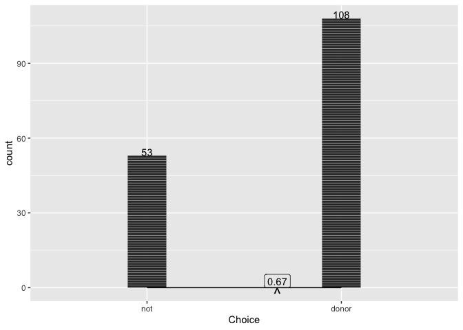

``` r
proportion_balance_plot +   # by 
  # stamp_prop, assertion, point
  annotate(geom = GeomText, x = .5 + 1, y = 0, vjust = 1, label = "^", 
           color = "red", size = 6) +
  # stamp_prop_label
  annotate(geom = GeomLabel, x = .5 + 1, y = 0, vjust = 0, label = .5, 
           color = "red", fill = NA) + 
  labs(title = "Is there statistical evidence that choice to be\nan organ donar differs from coin flip") ->
ho; ho
```


``` r
  
null = 0.5  # from null hypothesis
n = 161  # sample size
phat = 108/n  # sample proportion of successes
sd = sqrt(null * (1 - null)/n)  # sd of the null distribution


compute_dnorm_prop <- function(data, scales, null = .5, dist_sds = seq(-3.5, 3.5, by = .1)){

  n <- nrow(data)
  
  sd = sqrt(null * (1 - null)/n)
  
  q <- dist_sds * sd + null
  
  data.frame(x = q + 1) %>% 
    mutate(y = dnorm(q, sd = sd, mean = null))
  
}  

ho + 
  # geom_norm on prop plot
    qlayer(stat = qstat(compute_dnorm_prop),
         geom = qproto_update(GeomArea, aes(alpha = .2)),
         mapping = aes(x = 1, y = 1),
         # null = .5
         ) + 
    # geom_prop_norm w/ sd marks
    qlayer(stat = qstat(compute_dnorm_prop,
                        default_aes = aes(xend = after_stat(x), 
                                          yend = after_stat(0))),
           geom = qproto_update(GeomSegment, aes(linetype = "dotted")),
           mapping = aes(x = 1, y = 1),
           dist_sds = -3:3)
#> Warning in qlayer(stat = qstat(compute_dnorm_prop), geom = qproto_update(GeomArea, : All aesthetics have length 1, but the data has 161 rows.
#> ℹ Please consider using `annotate()` or provide this layer with data containing
#>   a single row.
#> Warning in qlayer(stat = qstat(compute_dnorm_prop, default_aes = aes(xend = after_stat(x), : All aesthetics have length 1, but the data has 161 rows.
#> ℹ Please consider using `annotate()` or provide this layer with data containing
#>   a single row.
```

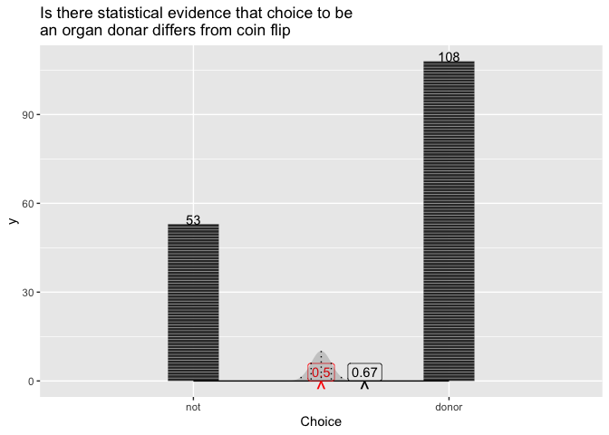

``` r


last_plot() + 
  coord_cartesian(xlim = c(1.45, 1.65), ylim = c(0, 15))
#> Warning in qlayer(stat = qstat(compute_dnorm_prop), geom = qproto_update(GeomArea, : All aesthetics have length 1, but the data has 161 rows.
#> ℹ Please consider using `annotate()` or provide this layer with data containing
#>   a single row.
#> All aesthetics have length 1, but the data has 161 rows.
#> ℹ Please consider using `annotate()` or provide this layer with data containing
#>   a single row.
```

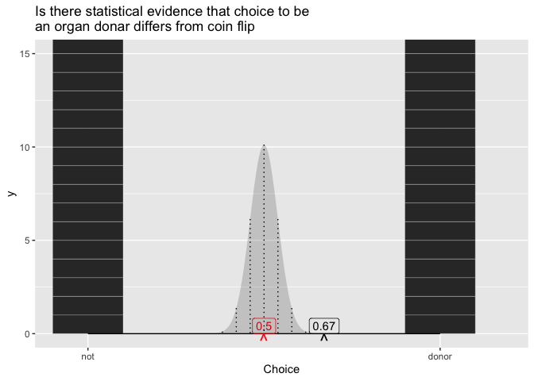

``` r

# layer_data(i = 3)

proportion_balance_plot + 
  facet_wrap(~Default, ncol = 1) + 
  labs(title = "Is there statistical evidence framing option as 'opt-in' v 'opt-out'\nlead to different outcomes?")
```

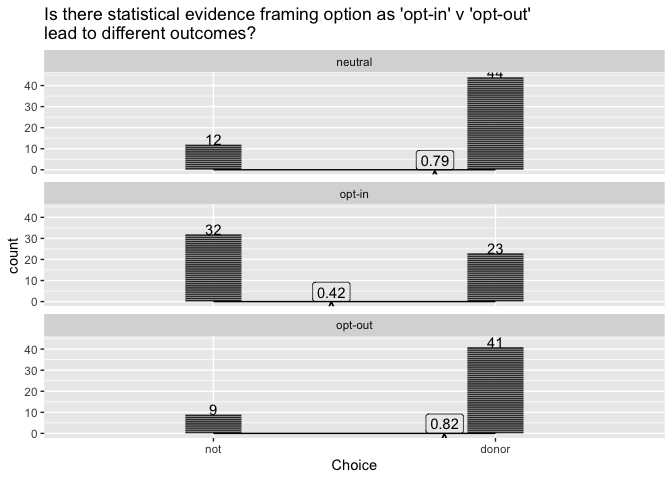

``` r


coffee_height <- read_delim("https://www.isi-stats.com/isi/data/chap6/CoffeeHeight.txt")
#> Rows: 51 Columns: 2
#> ── Column specification ────────────────────────────────────────────────────────
#> Delimiter: "\t"
#> chr (1): coffee
#> dbl (1): height
#> 
#> ℹ Use `spec()` to retrieve the full column specification for this data.
#> ℹ Specify the column types or set `show_col_types = FALSE` to quiet this message.
```

``` r

coffee_height
#> # A tibble: 51 × 2
#>    coffee height
#>    <chr>   <dbl>
#>  1 yes        65
#>  2 no         65
#>  3 no         72
#>  4 yes        69
#>  5 yes        66
#>  6 no         63
#>  7 yes        64
#>  8 no         63
#>  9 no         72
#> 10 no         62
#> # ℹ 41 more rows
```

``` r

coffee_height %>% 
  ggplot() + 
  aes(x = height) + 
  geom_rug() + 
  geom_histogram() + 
  # 1. geom_xrange_group(), show scale, range at y is zero
  qlayer(stat = qstat(compute_scale),
         geom = GeomSegment) + 
  # 2. geom_xmean() add balancing point
  qlayer(stat = qstat(compute_xmean_at_y0,
                      default_aes = aes(vjust = after_stat(1),
                                              label = after_stat("^"))),
         geom = qproto_update(GeomText, aes(size = 7))) + 
  # 3. geom_xmean_label() add numeric label
  qlayer(stat = qstat(compute_xmean_at_y0,
                      default_aes = aes(vjust = after_stat(0),
                                        label = after_stat(round(x, 2)))),
         geom = GeomLabel) + 
  labs(title = "Does the average height for this group differ statistically from the of 66 cm") ->
base_c_distribution; base_c_distribution
#> `stat_bin()` using `bins = 30`. Pick better value with `binwidth`.
```

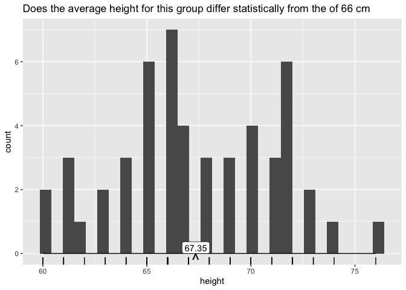

``` r

base_c_distribution +
  # stamp_prop, assertion, point
  annotate(geom = GeomText, x = 66, y = 0, vjust = 1, label = "^", 
           color = "red", size = 7) +
  # stamp_prop_label
  annotate(geom = GeomLabel, x = 66, y = 0, vjust = 0, label = 66, 
           color = "red") 
#> `stat_bin()` using `bins = 30`. Pick better value with `binwidth`.
```

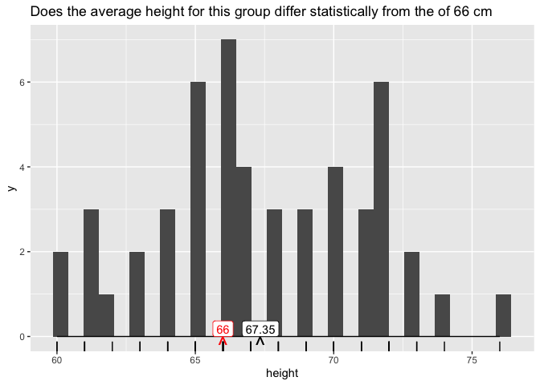

``` r


compute_dt_continuous <- function(data, scales, mean = NULL, dist_sds = seq(-3.5, 3.5, by = .1)){
  
  n = nrow(data)
  if(is.null(mean)){mean <- mean(data$x)}
  s = sd(data$x)  # sample standard deviation
  sd = s/sqrt(n)  #

  # q <- dist_sds * sd
  
  data.frame(x = mean + dist_sds) %>% 
    mutate(y = dt(dist_sds, df = n-1)) %>% 
    mutate(y = y/max(y))

  
}

coffee_height %>% 
  rename(x = height) %>% 
  compute_dt_continuous() %>% 
  head()
#>          x           y
#> 1 63.85294 0.003742670
#> 2 63.95294 0.004973024
#> 3 64.05294 0.006573744
#> 4 64.15294 0.008643080
#> 5 64.25294 0.011300496
#> 6 64.35294 0.014689561
```

``` r

last_plot() + 
  qlayer(stat = qstat(compute_dt_continuous),
         geom = qproto_update(GeomArea, 
                              aes(alpha = .3)),
         mean = 66,
         fill = "red"
         )
#> `stat_bin()` using `bins = 30`. Pick better value with `binwidth`.
```

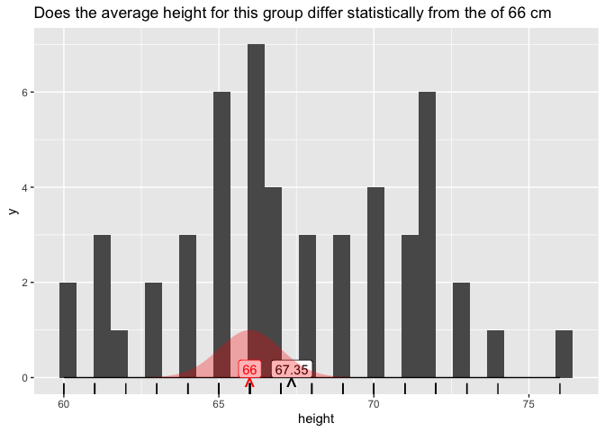

``` r
base_c_distribution + 
  facet_wrap(~ coffee, ncol = 1) + 
  labs(title = "Is there a statistically significant difference between the coffee drinkers\n and non-drinkers for this group?")
#> `stat_bin()` using `bins = 30`. Pick better value with `binwidth`.
```

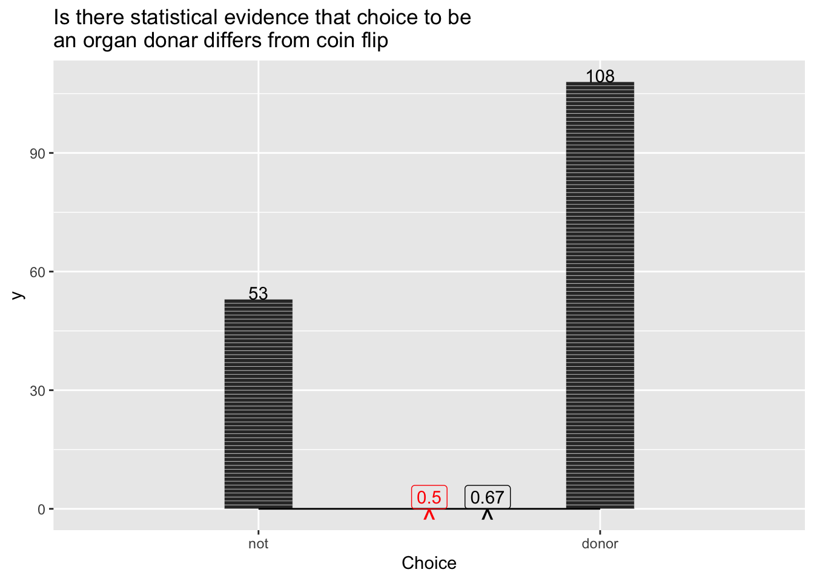

``` r
compute_panel_lm <- function(data, scales){
  
  data <- remove_missing(data)
  model <- lm(data = data, formula = y ~ x + cat)
  data$y <- model$fitted

  data
  
}

palmerpenguins::penguins %>% 
  select(x = body_mass_g, y = flipper_length_mm, cat = species) %>% 
  compute_panel_lm()
#> Warning: Removed 2 rows containing missing values or values outside the scale
#> range.
#> # A tibble: 342 × 3
#>        x     y cat   
#>    <int> <dbl> <fct> 
#>  1  3750  190. Adelie
#>  2  3800  191. Adelie
#>  3  3250  186. Adelie
#>  4  3450  188. Adelie
#>  5  3650  190. Adelie
#>  6  3625  189. Adelie
#>  7  4675  198. Adelie
#>  8  3475  188. Adelie
#>  9  4250  195. Adelie
#> 10  3300  187. Adelie
#> # ℹ 332 more rows
```

``` r
  
ggplot(palmerpenguins::penguins) + 
  aes(x = body_mass_g, y = flipper_length_mm, cat = species) + 
  geom_point() + 
  # geom_lm_xycat
  qlayer(stat = qstat_panel(compute_panel_lm),
         geom = qproto_update(GeomLine, aes(color = "blue",
                                            linewidth = 1)),
         aes(color = species)) 
#> Warning: Removed 2 rows containing missing values or values outside the scale
#> range.
#> Warning: Removed 2 rows containing missing values or values outside the scale range
#> (`geom_point()`).
```

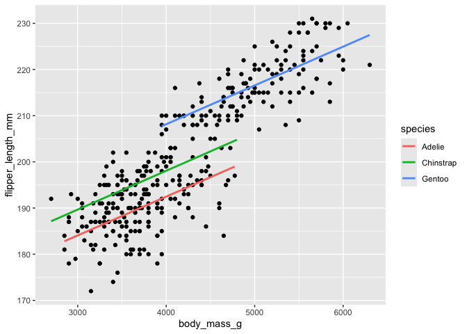

``` r


two_way_probs <- tibble()
```
